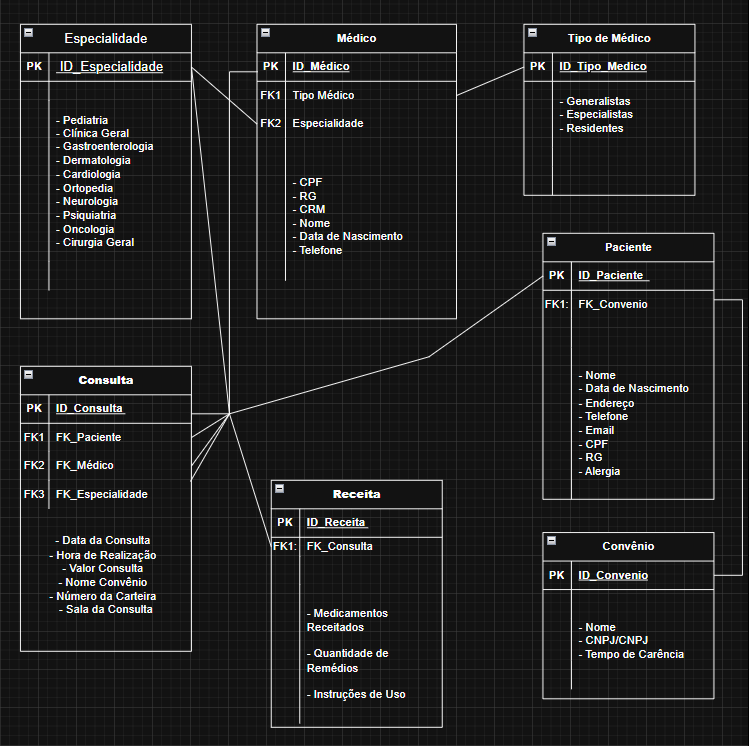
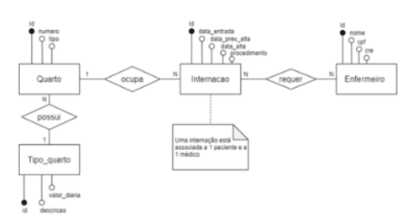
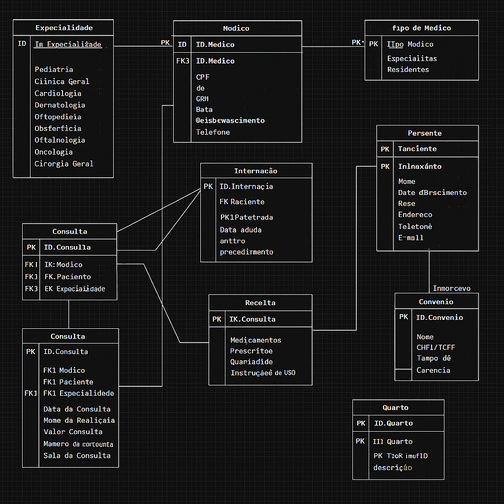

# O Hospital Fundamental
Parte 1

Um pequeno hospital local busca desenvolver um novo sistema que atenda melhor às suas necessidades. Atualmente, parte da operação ainda se apoia em planilhas e arquivos antigos, mas espera-se que esses dados sejam transferidos para o novo sistema assim que ele estiver funcional.

O hospital necessita de um sistema para sua área clínica que ajude a controlar consultas realizadas. Os médicos podem ser generalistas, especialistas ou residentes e têm seus dados pessoais cadastrados em planilhas digitais. Cada médico pode ter uma ou mais especialidades, que podem ser pediatria, clínica geral, gastroenterologia e dermatologia. Alguns registros antigos ainda estão em formulário de papel, mas será necessário incluir esses dados no novo sistema.

Os pacientes também precisam de cadastro, contendo dados pessoais (nome, data de nascimento, endereço, telefone e e-mail), documentos (CPF e RG) e convênio. Para cada convênio, são registrados nome, CNPJ e tempo de carência.

As consultas também têm sido registradas em planilhas, com data e hora de realização, médico responsável, paciente, valor da consulta ou nome do convênio, com o número da carteira. Também é necessário indicar na consulta qual a especialidade buscada pelo paciente.

Deseja-se ainda informatizar a receita do médico, de maneira que, no encerramento da consulta, ele possa registrar os medicamentos receitados, a quantidade e as instruções de uso

# Os Segredos do Hospital
Parte 2

Após a primeira versão do projeto de banco de dados para o sistema hospitalar, notou-se a necessidade de expansão das funcionalidades, incluindo alguns requisitos essenciais a essa versão do software. As funcionalidades em questão são para o controle na internação de pacientes. Será necessário expandir o Modelo ER desenvolvido e montar o banco de dados, criando as tabelas para o início dos testes.

Entender do assunto Considere a seguinte descrição e o diagrama ER abaixo:

No hospital, as internações têm sido registradas por meio de formulários eletrônicos que gravam os dados em arquivos.

Para cada internação, são anotadas a data de entrada, a data prevista de alta e a data efetiva de alta, além da descrição textual dos procedimentos a serem realizados.

As internações precisam ser vinculadas a quartos, com a numeração e o tipo.

Cada tipo de quarto tem sua descrição e o seu valor diário (a princípio, o hospital trabalha com apartamentos, quartos duplos e enfermaria).

Também é necessário controlar quais profissionais de enfermaria estarão responsáveis por acompanhar o paciente durante sua internação. Para cada enfermeiro(a), é necessário nome, CPF e registro no conselho de enfermagem (COREN).

A internação, obviamente, é vinculada a um paciente – que pode se internar mais de uma vez no hospital – e a um único médico responsável.

Mãos a obra? Faça a ligação do diagrama acima ao diagrama desenvolvido na atividade antrior, construindo relacionamentos com entidades relacionadas. E eleve o seu diagrama para que já selecionando os tipos de dados que serão trabalhados e em quais situações.

Por último, crie um script SQL para a geração do banco de dados e para instruções de montagem de cada uma das entidades/tabelas presentes no diagrama completo (considerando as entidades do diagrama da atividade anterior e as novas entidades propostas no diagrama acima). Também crie tabelas para relacionamentos quando necessário. Aplique colunas e chaves primárias e estrangeiras.

# PARTE 3 - Alimentando o banco de dados
Nesta etapa, realizamos o povoamento do banco de dados para o sistema hospitalar, seguindo as seguintes atividades:

Inclusão de 10 médicos com diferentes especialidades.

Registro de 7 especialidades, sendo elas: Pediatria, Clínica Geral, Gastrenterologia, Dermatologia, Cardiologia, Ortopedia e Neurologia.

Cadastro de 15 pacientes.

Registro de 20 consultas, realizadas entre 01/01/2015 e 01/01/2022:

Alguns pacientes realizaram mais de uma consulta.

Pelo menos 10 consultas possuem receituário com dois ou mais medicamentos.

Inclusão de 4 convênios médicos, associados a 5 pacientes e 5 consultas.

Criação da entidade de relacionamento entre médico e especialidade.

Criação da entidade de relacionamento entre internação e enfermeiro.

Ajuste da chave estrangeira entre convênio e médico.

Inclusão de chaves estrangeiras dentro da tabela de internação (Médico e Paciente).

Registro de 7 internações, ocorridas entre 01/01/2015 e 01/01/2022:

Pelo menos 2 pacientes se internaram mais de uma vez.

Cadastro de ao menos 3 tipos de quartos: Apartamentos, Quartos Duplos e Enfermaria, com valores diferentes.

Inclusão de 10 profissionais de enfermagem, com cada internação associada a pelo menos 2 enfermeiros.

O povoamento dos dados garante que o banco esteja preparado para os testes e validação da viabilidade do sistema hospitalar

# PARTE 4 - Alterando o banco de dados
Nesta etapa, realizamos alterações estruturais e de dados no banco de dados do sistema hospitalar, para refletir mudanças e evoluções no sistema.

✔️ Alterações realizadas:
Adição da coluna em_atividade na tabela medicos:
Essa coluna indica se o médico ainda está atuando no hospital (sim) ou se está inativo (nao).

Atualização dos dados dos médicos:

Dois médicos foram atualizados como inativos, simulando desligamento ou aposentadoria.
Os demais médicos permaneceram como ativos.

# PARTE 5 - Consultas
Neste diretório está o arquivo parte_5_consultas.sql, que contém as consultas SQL para simular relatórios e validar o funcionamento do banco do sistema hospitalar.

As consultas retornam dados como:

Consultas do ano de 2020 e sob convênio, com valor médio
Internações com alta após data prevista
Receituário da primeira consulta
Consultas de maior e menor valor (sem convênio)
Internações com cálculo do valor total conforme diárias do quarto
Dados filtrados de internações e consultas conforme critérios específicos
Listagem de médicos e enfermeiros com contagem de atendimentos/internações
E consultas específicas para testes com nomes, especialidades e datas
✅ Modelo Entidade-Relacionamento (MER e DER) O modelo ER foi projetado para refletir a estrutura lógica e física do sistema, contendo as seguintes entidades principais:

Médico

Especialidade

Paciente

Convênio

Consulta

Receita

Internação

Quarto

Tipo de Quarto

Enfermeiro

✅ Como usar

Clone o repositório.

Execute o script SQL script.sql no seu SGBD.

Visualize o diagrama no dbdiagram.io usando o código dbdiagram.txt.
